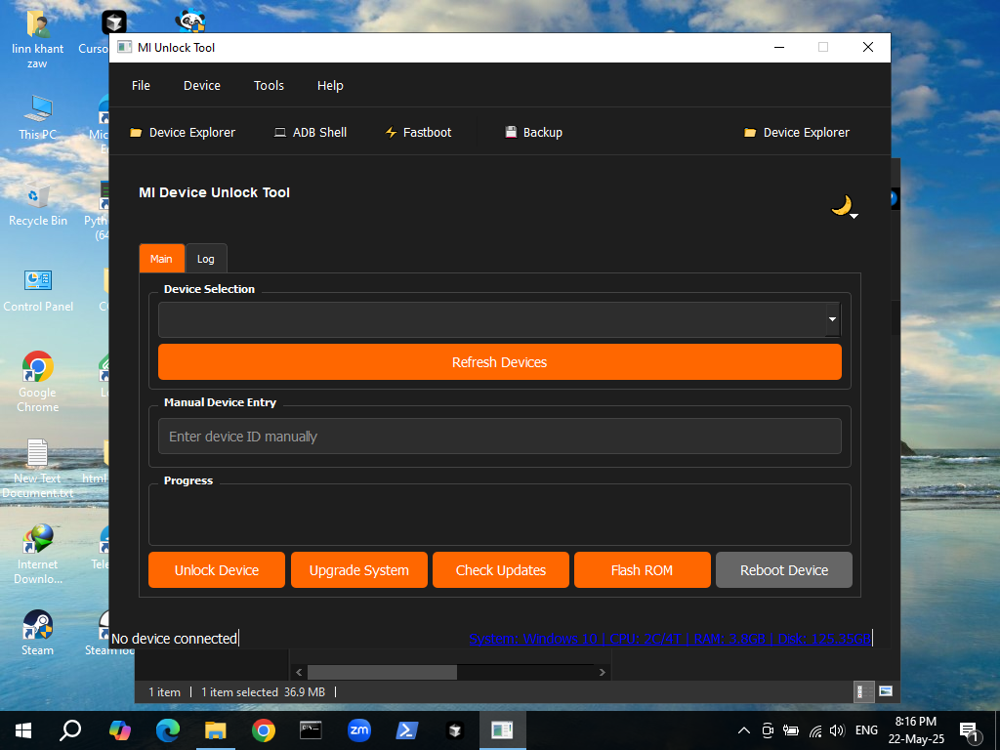

# MI Unlock Tool

A comprehensive tool for managing and unlocking Xiaomi devices, built with Python and PyQt5.

## Screenshots

### Main Interface

*Main window showing device connection and status*

### Device Information

*Detailed device information display*

### Settings

*Application settings and configuration*

### Unlock Process

*Bootloader unlocking interface*

## Features

- 🔍 Device Detection and Management
- 🔓 Bootloader Unlocking
- 🔄 System Upgrade and Updates
- 📱 ROM Flashing and Verification
- 💻 ADB Shell and Fastboot Access
- 💾 Device Backup and Recovery
- 🎨 Multiple Theme Support

## Installation

### Prerequisites

- Python 3.8 or higher
- ADB and Fastboot tools
- USB debugging enabled on your device

### Windows Installation

1. Download the latest release from the [Releases](https://github.com/LKZOwner/MI-UnlockTool-Open-Source.git/releases) page
2. Extract the ZIP file
3. Run `MIUnlockTool.exe`

### Development Installation

1. Clone the repository:
   ```bash
   git clone https://github.com/LKZOwner/MI-UnlockTool-Open-Source.git
   ```

2. Create a virtual environment:
   ```bash
   python -m venv venv
   source venv/bin/activate  # On Windows: venv\Scripts\activate
   ```

3. Install dependencies:
   ```bash
   pip install -r requirements.txt
   ```

4. Run the application:
   ```bash
   python mi_unlock_tool.py
   ```

## Usage

1. Connect your Xiaomi device via USB
2. Enable USB debugging in Developer Options
3. Launch MI Unlock Tool
4. Select your device from the dropdown menu
5. Choose the desired operation:
   - Unlock Device
   - Upgrade System
   - Check Updates
   - Flash ROM
   - Reboot Device

## Features in Detail

### Device Management
- Automatic device detection
- Device information display
- Multiple device support
- Device explorer

### Unlocking Tools
- Bootloader unlocking
- Lock status verification
- Unlock status check
- Recovery tools

### System Tools
- System updates
- ROM flashing
- Backup and restore
- ADB shell access
- Fastboot mode

### Additional Features
- Multiple themes
- Dark mode support
- Logging system
- Auto-updates
- System tray support

## Contributing

We welcome contributions! Please see our [Contributing Guide](CONTRIBUTING.md) for details.

## License

This project is licensed under the MIT License - see the [LICENSE](LICENSE) file for details.

## Authors

- LKZ_Owner (Main Developer)
- Claude (AI Assistant)

## Acknowledgments

- Xiaomi for their devices
- The open-source community
- All contributors and users

## Support

- [Documentation](docs/)
- [Issues](https://github.com/your-repo/mi-unlock-tool/issues)
- [Discussions](https://github.com/your-repo/mi-unlock-tool/discussions)

## Roadmap

- [ ] Multi-language support
- [ ] Advanced backup features
- [ ] Custom ROM support
- [ ] Device-specific optimizations
- [ ] Cloud backup integration

## Changelog

See [CHANGELOG.md](CHANGELOG.md) for a list of changes. 